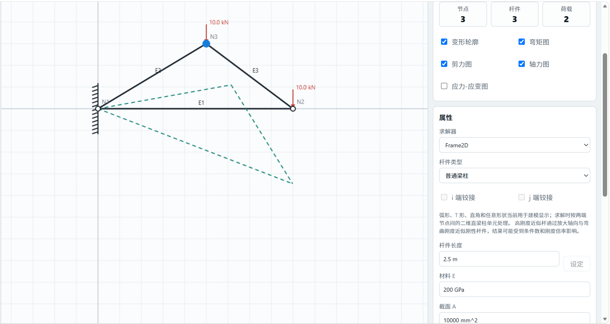
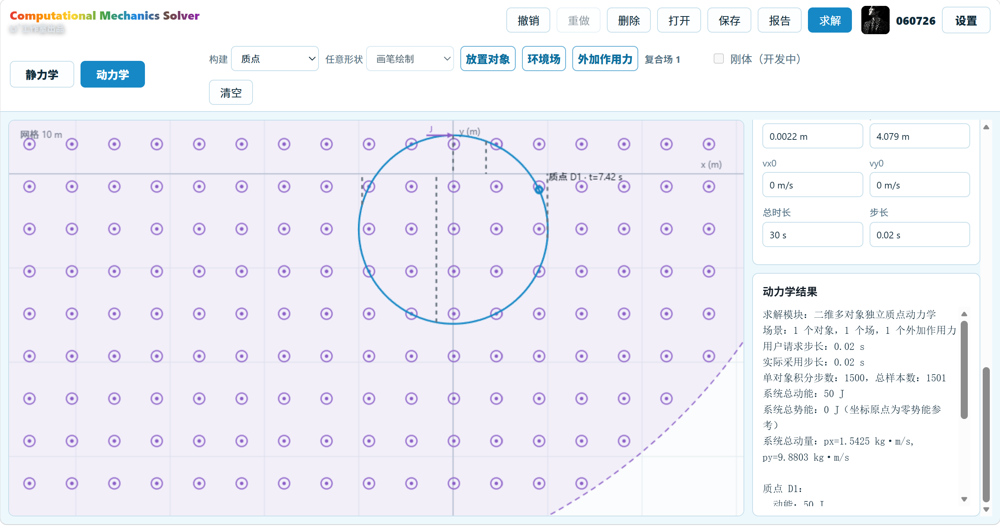
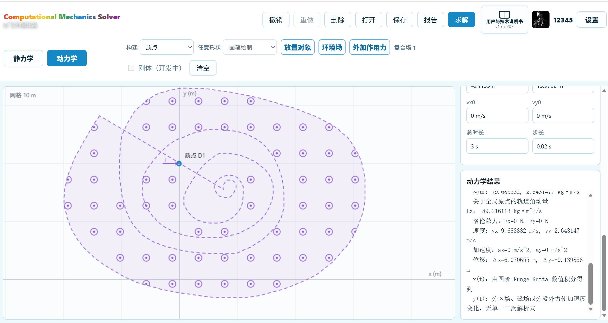

# 阅读本手册

Computational Mechanics Solver 是一个面向力学学习、教学演示和原型验证的二维计算工具。它把图形建模、单位换算、静力学求解、动力学积分、结果图形和计算报告连接成一个工作流。本手册从第一次打开软件开始，说明怎样建立模型、怎样检查结果，以及哪些问题超出当前版本的能力范围。

> **安全提示：** 本软件不是经过工程认证的设计软件。任何与建筑、机械、交通、能源或人身安全有关的结论，都必须由具备相应资质的专业人员使用独立方法复核。不要只凭一张内力图、一个最大值或一份自动报告作出工程安全决定。

## 适合哪些读者

- 第一次接触结构力学软件的本科生。
- 需要演示刚度法、梁柱内力或质点运动的教师。
- 希望比较解析解与数值结果的课程学习者。
- 需要快速搭建二维原型模型的普通用户。

## 软件可以完成什么

:::table id=capability-summary title=v1.3.2 主要能力
| 模块 | 当前可用能力 | 读取结果时的重点 |
|---|---|---|
| 静力学 | 二维梁柱、平面桁架、节点荷载、杆中集中作用、分布荷载、单端弯矩释放 | 位移、反力、轴力、剪力、弯矩和模型诊断 |
| 动力学 | 多个彼此独立的二维质点、重力场、电场、垂直平面磁场、冲量、持续力 | 位置、速度、加速度、轨迹、动能、势能、动量和轨道角动量 |
| 工程管理 | 撤销、重做、保存、打开和报告下载 | 保存文件后再更换设备或清理浏览器数据 |

## 当前不能解决什么

- 材料屈服、塑性、开裂、疲劳、断裂和几何大变形。
- 工程规范校核、荷载组合、抗震设计和承载力认证。
- 斜向滚动约束、弹性地基、双端弯矩释放和通用半刚接。
- 对象之间的碰撞、接触、弹簧、多体约束和真正刚体自转。
- 沿轨道滑动或无滑动滚动。
- 随时间或空间表达式变化的重力场、电场和磁场。

当界面上出现“开发中”时，该功能不能作为计算依据。尤其是 PINNs、刚体转动、碰撞和轨道约束，在 v1.3.2 中没有完整求解能力。

# 第一次使用

## 浏览器和显示要求

建议使用当前稳定版 Microsoft Edge 或 Google Chrome。桌面浏览器更适合建模；较小屏幕可以查看工程和结果，但复杂模型的操作效率会下降。浏览器应允许下载工程文件和 PDF 报告。

## 注册、登录与本地配置

v1.3.2 首页提供登录、注册、昵称和头像设置，但这些信息只保存在当前浏览器中，并不构成云端账户。注册后可以进入模块选择页；退出登录会回到欢迎页面。

1. 点击“注册”，输入账户名、密码和昵称。
2. 可选择头像，也可以保留默认的 CM 头像。
3. 注册完成后点击“开始计算”。
4. 在模块选择页进入“静力学”或“动力学”。
5. 使用右上角“设置”修改字体、昵称、密码提示或头像。

> 不要在本地配置中保存身份证号、银行卡号、密钥或常用重要密码。清理浏览器数据、使用无痕模式或更换设备后，本地配置不会自动同步。

## 模块切换

静力学使用绿色操作风格，动力学使用蓝色操作风格。两个模块共享打开、保存、撤销、重做、报告和设置入口。切换模块前应先保存当前工程，避免把尚未导出的模型只留在浏览器状态中。

# 通用建模操作

## 无限画布与局部视口

画布表示一个可继续扩展的世界坐标平面，屏幕只显示其中一部分。鼠标滚轮用于缩放；选择模式下拖动画布可以平移视口。缩放和平移只改变观察方式，不改变节点坐标或动力学对象的位置。

## 网格、捕捉和正交

- “网格”控制辅助网格是否显示。
- “捕捉”使新对象靠近网格或已有节点。
- “正交”用于把绘制方向限制为水平或竖直。
- 输入精确长度或坐标后，应再次检查单位和方向。

## 选择与删除

单击对象可以点选；框选用于一次选择多个对象。删除前确认高亮对象是否正确。若误删，立即使用撤销。开始另一种绘图工具、切换模块或按 Escape 时，未完成的草稿应取消，不应成为正式模型。

## 撤销、重做、保存和打开

撤销和重做按完整操作记录模型变化。保存会下载工程文件；打开会读取已经保存的工程。建议在以下时点保存独立版本：

- 几何建模完成后。
- 支座和荷载检查完成后。
- 求解成功并完成平衡检查后。
- 对材料、截面、场或时间步作较大修改前。

## 单位规则

界面允许使用常见工程单位，计算核心会换算为国际单位制。不要只输入数字而忽略单位。

:::table id=unit-guide title=常用输入与显示单位
| 物理量 | 常用输入 | 核心计算单位 |
|---|---|---|
| 长度、位移 | mm、m | m |
| 力 | N、kN | N |
| 力矩 | N·m、kN·m | N·m |
| 分布荷载 | N/m、kN/m | N/m |
| 弹性模量、应力 | MPa、GPa | Pa |
| 面积、惯性矩 | mm²、mm⁴、m²、m⁴ | m²、m⁴ |
| 时间、速度、加速度 | s、m/s、m/s² | s、m/s、m/s² |
| 电场、磁场 | N/C、T | N/C、T |

# 静力学建模

## 节点与自由度

节点记录二维坐标和约束状态。每个普通静力学节点有两个平移自由度和一个转角自由度：

:::equation id=node-dofs text=u_i=(u_x,u_y,theta_z)^T

建立杆件前先放置节点。节点重合但没有真正连接时，画面可能看似相交而求解模型仍然断开；应使用节点捕捉或明确复用同一节点。

## 普通梁柱

普通梁柱按小位移、线弹性 Euler-Bernoulli 梁理论计算，主要参数为弹性模量 E、截面面积 A 和惯性矩 I。它可以传递轴力、剪力和弯矩。泊松比、惯性积、静矩和显示截面形状虽然可以保存，但并非全部进入当前刚度和应力恢复。

## 平面桁架

桁架杆只传递轴力。其轴向刚度与 EA/L 成正比：

:::equation id=truss-stiffness text=k_a=EA/L

桁架杆中不能直接承受横向集中力、横向分布荷载或力偶。遇到这类荷载，应在荷载位置增加节点并重新划分模型，或改用普通梁柱单元。

## 高刚度近似杆

界面中的高刚度近似杆通过放大普通杆件刚度模拟近似刚性连接。它不是严格的刚体约束，倍率过大会使方程条件变差。使用后应改变倍率重复计算，确认关键结果对倍率不敏感。

## 材料与截面

选择杆件工具后，可设置材料和截面。若没有可靠的截面数据，不要只凭显示半径推断面积或惯性矩。对于圆截面，理论上可由半径计算面积和惯性矩；对于其他截面，优先使用课程题目、设计资料或独立截面计算得到的数值。

## 显示形状与求解形状

弧形、T 形、直角和任意路径在 v1.3.2 中主要用于显示。静力学求解仍把两端节点之间的直线作为梁柱轴线。若曲率、分叉或中间节点会影响受力，应把几何拆分为足够多的真实节点和单元，不能只依赖外观。

# 支座、连接与荷载

## 固定端、铰支座和滚动支座

:::table id=support-guide title=常见支座及其理想约束
| 支座 | 典型约束 | 允许运动 |
|---|---|---|
| 固定端 | 约束水平、竖直和平面转角 | 不允许节点平移或转动 |
| 铰支座 | 约束水平和竖直平移 | 允许节点转动 |
| 滚动支座 | 约束一个全局平移方向 | 允许沿另一个全局方向移动并允许转动 |

支座图标可以旋转，但 v1.3.2 的求解约束仍按全局水平、竖直和转角布尔状态处理。旋转图标不等于建立斜向滚动约束。地基阴影只是绘图符号，不是弹性地基或接触单元。

## 节点固化

节点固化用于隐藏节点标记，使节点在视觉上成为杆件的一部分。连接关系仍通过节点保存。固化不是删除节点，也不会自动合并两个不同节点的自由度。

## 单端弯矩释放

普通梁柱可以在 i 端或 j 端设置单端弯矩释放。释放端不传递弯矩，但仍可传递轴力和剪力。v1.3.2 不支持同一单元的双端弯矩释放，也不支持轴向释放、剪切释放、半刚接和转动弹簧。

## 集中力与集中力偶

集中力可以施加在节点或普通杆件中间。选择方向或输入角度后，再设置大小和作用位置。同一杆件可以保存多个集中作用，求解时会累加。集中力偶的正负方向必须结合界面箭头和坐标系检查。

## 分布荷载

分布荷载支持均布、线性变化和多项式形式。矩形分布对应常值，三角形或梯形分布对应两端不同的线性值。任意分布在当前版本中采用有限多项式系数，不是可以输入任意程序代码的通用函数。

> 沿杆均布力偶在 v1.3.2 中尚未实现。若界面出现相关入口，应以明确错误提示为准，不要把未求解的图形当成有效荷载。

# 静力学求解与结果

## 模型诊断

求解前先查看模型诊断。常见问题包括孤立节点、零长度杆件、无效材料参数、未连接部分和约束不足。诊断用于提前发现问题，但“没有错误”仍不等于结构一定稳定；最终还要看方程是否可解和结果是否满足平衡。

## 刚度法

线性静力学的总体方程为：

:::equation id=static-equilibrium text=K u=P

施加约束后，软件求解自由自由度，再恢复约束反力：

:::equation id=reaction-recovery text=R=K u-P

若刚度矩阵奇异，常见原因是支座不足、节点没有真正连接、释放过多、存在机构或杆件长度为零。

## 求解选项

点击“求解”后，可以选择需要的结果。建议至少选择位移、支座反力、轴力图、剪力图、弯矩图和体系判断。选择越多并不会改变方程，只会增加展示和报告内容。

## 位移、转角和反力

位移结果按节点输出水平位移、竖直位移和转角。反力只出现在受约束自由度。读取时注意：结果摘要中的“最大平移”通常扫描节点；若跨中没有节点，它不能代表梁跨中的连续最大挠度。

## 轴力图、剪力图和弯矩图

N、V、M 图分别使用独立直角坐标系。横坐标是杆件局部位置 x，纵坐标标明物理量和单位。集中横向力会引起剪力跳变，集中轴向力会引起轴力跳变，集中力偶会引起弯矩跳变。

## 结果的基本核对

1. 把全部竖向外荷载与竖向反力相加，检查是否接近零。
2. 对任意参考点计算外力矩与反力矩，检查是否平衡。
3. 检查对称结构和对称荷载是否产生对称反力与变形。
4. 用一个解析公式、课程标准答案或独立软件复核关键值。
5. 改变网格、单元划分或近似参数，检查结论是否稳定。

# 静力学案例

## 教学案例：悬臂梁端部集中力

### 案例目标与场景

本案例演示固定端梁的建模、位移、转角、反力和内力读取。梁长 L=2 m，A 端固定，B 端承受竖直向下集中力 P=10 kN。

### 已知条件与参数输入

:::table id=cantilever-input title=悬臂梁输入参数
| 参数 | 数值 | 单位 |
|---|---|---|
| 梁长 L | 2 | m |
| 弹性模量 E | 200 | GPa |
| 截面面积 A | 10000 | mm² |
| 惯性矩 I | 80000000 | mm⁴ |
| 端部集中力 P | 10 | kN |

### 软件操作步骤

1. 放置 A、B 两个节点，令两点水平相距 2 m。
2. 使用普通梁柱连接 A、B，并输入 E、A、I。
3. 在 A 点施加固定端支座。
4. 在 B 点施加竖直向下 10 kN 集中力。
5. 求解位移、反力、剪力图和弯矩图。

### 理论结果

自由端位移和转角为：

:::equation id=cantilever-deflection text=u_y(B)=-(P L^3)/(3 E I)

:::equation id=cantilever-rotation text=theta_z(B)=-(P L^2)/(2 E I)

固定端竖向反力为 P，固定端反力矩为 PL。

### 软件结果、误差与解释

:::table id=cantilever-result title=悬臂梁程序结果与解析检查
| 结果 | 程序值 | 解析检查 |
|---|---|---|
| B 点竖向位移 | -1.6666667 mm | 与式 {{eq:cantilever-deflection}} 一致 |
| B 点转角 | -1.25×10⁻³ rad | 与式 {{eq:cantilever-rotation}} 一致 |
| A 点竖向反力 | 10.000 kN | 与外荷载平衡 |
| A 点反力矩 | 20.000 kN·m | 等于 PL |
| 最大剪力绝对值 | 10.000 kN | 全梁常剪力 |
| 最大弯矩绝对值 | 20.000 kN·m | 固定端控制 |

数值结果与解析关系在显示精度内一致。常见错误是惯性矩单位输入错误、集中力方向反向或固定端没有约束转角。该案例只验证线弹性小位移梁理论，不代表材料强度或稳定性已经满足。

## 用户静力学案例一：三角形平面刚架

### 案例目标与建模场景

该案例来自用户实际建模截图，用于展示三节点、三杆件和两个节点集中力的平面刚架工作流。截图显示 N2、N3 各有 10.0 kN 竖直向下集中力，N1 附近有墙面支承符号，并勾选变形轮廓、弯矩图、剪力图和轴力图。

模型与变形轮廓见图 {{fig:user-static-case-1}}。

{#user-static-case-1 width=155mm}

### 已知条件、操作和求解设置

:::table id=user-static-1-evidence title=用户静力学案例一证据表
| 项目 | 已知内容 | 证据边界 |
|---|---|---|
| 几何 | 3 个节点、3 根普通梁柱 | 完整坐标未提供 |
| 荷载 | N2、N3 各向下 10.0 kN | 荷载标签在截图中可见 |
| 材料与截面 | 选中杆件显示 E=200 GPa、A=10000 mm²、长度 2.5 m | 其余杆件参数和惯性矩未完整显示 |
| 支座 | N1 附近有墙面支承图标 | 无法由截图唯一恢复全部约束状态 |
| 求解设置 | Frame2D；变形、M、V、N 图 | 数值结果面板未显示 |

### 软件结果、理论结果和误差

截图可确认模型计数、荷载标注和绿色虚线变形轮廓已经显示，但没有完整工程文件、节点坐标、全部截面参数、支座布尔状态、反力和内力数值。因此本案例**无法完全复算**，不能给出可信的理论误差百分比，也不能声称数值结果已经验证。

### 结果解释、常见错误与限制

变形轮廓只能说明软件生成了位移显示，不代表结构稳定、平衡或强度满足要求。重新建立此案例时，必须检查 N1 的真实约束、三根杆件的惯性矩、节点是否真正连接以及两条 10 kN 荷载是否进入同一工程文件。

<!-- REQUIRED_CASE: user-static-case-2 is still missing. -->

# 动力学建模

## 对象与初始条件

动力学画布初始为空。用户先配置对象，再点击“放置对象”在画布指定位置。每个对象至少需要正质量、初始位置和初速度；带电运动还需要电荷量。

当前平动状态为：

:::equation id=dynamics-state text=Y=(x,y,v_x,v_y)^T

质点、杆、圆、圆环、矩形和任意形状可以有不同外观和惯量估算，但 v1.3.2 的运动方程仍按彼此独立的质点平动处理。显示为圆盘不等于已经求解自转。

## 对象尺寸

显示尺寸用于画布比例和简单惯量估算。圆和圆环可设置半径，矩形可设置长宽，杆可设置长度。尺寸不能代替质量、密度或真实接触几何；对象之间仍会相互穿过。

# 环境场与外加作用力

## 重力场

重力场由大小和方向角确定。若方向角为 θ，则重力加速度分量为：

:::equation id=gravity-vector text=g=(g cos(theta),g sin(theta))

全局重力场对所有位置生效；有限范围重力场只在指定区域内生效。

## 电场

电场对带电对象产生 qE 力。电荷为零时，电场不改变对象运动。改变电荷正负号会改变受力方向。

## 磁场

二维磁场使用垂直画布的 Bz。点场表示向外，叉场表示向内。洛伦兹力为：

:::equation id=lorentz-force text=F=q(E+v cross B)

理想均匀磁场中的磁力与速度垂直，不改变动能。若轨迹不闭合，应先减小时间步，再检查对象是否离开有限场范围或受到其他外力。

## 全局、矩形、圆形和任意范围

场可以覆盖全局，也可以限制在矩形、圆形或闭合多边形中。矩形通过角点确定，圆形通过圆心和半径确定，任意范围通过闭合路径确定。任意路径至少要有三个不共线点，并围成非零面积。

多个场可以叠加，且范围可以不同。对象所在位置同时落入多个场时，各场贡献会合并。有限重力场或电场跨越边界时，势能参考可能不连续，因此不能简单把机械能跳变全部归因于时间积分误差。

## 瞬时力与冲量

瞬时作用在仿真开始时改变速度，随后不再持续。若冲量为 J，则速度改变量为：

:::equation id=impulse text=Delta v=J/m

v1.3.2 的冲量固定发生在初始时刻，不能安排在任意后续时刻。

## 持续力

持续力可设置 x、y 分量、开始时间和持续时间。多个持续力可以作用于同一对象。开始或结束时刻若不落在时间步节点上，会产生启停时刻误差；应使用更小步长复算。

# 动力学求解与结果

## 四阶 Runge-Kutta 积分

软件使用固定步长经典四阶 Runge-Kutta 方法。对状态方程 dY/dt=f(t,Y)，每一步依次计算四个斜率：

:::equation id=rk4-k1 text=k_1=f(t_n,Y_n)

:::equation id=rk4-k2 text=k_2=f(t_n+h/2,Y_n+h k_1/2)

:::equation id=rk4-k3 text=k_3=f(t_n+h/2,Y_n+h k_2/2)

:::equation id=rk4-k4 text=k_4=f(t_n+h,Y_n+h k_3)

:::equation id=rk4-update text=Y_(n+1)=Y_n+h(k_1+2k_2+2k_3+k_4)/6

最后一步会缩短到准确的总时长。当前没有自适应步长、事件求根或辛积分器。

## 速度、加速度和位移

结果区显示终态速度、加速度和从初始位置到终态的位移。位移不是终态坐标；若初始位置不在原点，两者数值不同。轨迹方程只有在全程恒加速度且场状态不切换时才可能写成单一二次式，否则应使用数值轨迹。

## 能量、动量和角动量

动能和线动量为：

:::equation id=kinetic-energy text=T=m(v_x^2+v_y^2)/2

:::equation id=linear-momentum text=p=m v

当前角动量是关于全局原点的轨道角动量：

:::equation id=orbital-angular-momentum text=L_z=m(x v_y-y v_x)

它不是对象绕形心的自转角动量。多个对象的系统结果只是对各独立对象求和，不包含相互作用能。

## 轨迹动画

选择“位移轨迹”后，软件使用已经计算的样本回放对象运动并保留路径。动画不是第二次求解；缩放和平移也不会改变样本世界坐标。

## 步长收敛检查

用步长 h 求解后，再用 h/2 求解一次，比较终态位置、速度和能量。若差异仍大，继续减小步长。强磁场、长时间运动、有限场边界和快速启停外力更需要此检查。

# 碰撞、轨道与变化场

## v1.3.2 的真实状态

v1.3.2 **不能**设置对象碰撞、接触、斜坡、轨道、无滑动滚动或安全表达式变化场。对象轨迹相交时会相互穿过；圆盘只有显示和惯量估算，没有姿态与角速度积分。

## 为什么不能只画出这些效果

碰撞需要检测接触、计算法向和摩擦冲量并修正穿透；偏心力需要力矩和转动方程；轨道需要约束反力、摩擦、离轨和端点处理；滚动还需要 v=Rω。仅画箭头或旋转动画不能替代这些方程。

## 当前可采用的替代方法

- 把碰撞前后的过程拆成两个独立阶段，并用动量定理手工连接。
- 对斜面问题使用解析加速度或在外部建立切向坐标，再把结果与软件自由运动比较。
- 用多个常量有限场近似分段场，并进行步长与分区敏感性检查。
- 在报告中明确写出这些近似，不把结果称为完整碰撞或多体仿真。

# 动力学案例

## 教学案例：全局重力场抛体

### 案例目标与已知条件

本案例演示质点、重力场、轨迹、速度、能量和解析检查。质量 m=1 kg，初始位置为 (0,0) m，初速度为 (8,12) m/s；重力场大小 9.8 m/s²，方向竖直向下；总时长 2 s，步长 0.02 s，无其他外力。

### 软件操作步骤

1. 选择质点并输入质量、位置和初速度。
2. 放置对象。
3. 添加全局重力场，大小 9.8 m/s²、方向 -90°。
4. 设置总时长 2 s、步长 0.02 s。
5. 求解速度、加速度、位移、轨迹、动能、势能和动量。

### 理论结果

:::equation id=projectile-x text=x(t)=8t

:::equation id=projectile-y text=y(t)=12t-4.9t^2

### 软件结果、误差与解释

:::table id=projectile-result title=抛体运动终态结果
| 结果 | 软件值 | 解析值 |
|---|---|---|
| 终态位置 | (16.0000, 4.4000) m | 由式 {{eq:projectile-x}}、{{eq:projectile-y}} 得到 |
| 终态速度 | (8.0000, -7.6000) m/s | 常加速度关系 |
| 终态加速度 | (0, -9.8) m/s² | 重力场输入 |
| 机械能 | 104.00 J | 与初始机械能一致 |
| 步数与样本 | 100 步、101 点 | 2/0.02 与初始点 |

位置、速度和机械能与解析关系在显示精度内一致。常见错误包括把重力方向设为向上、同时施加重复持续力或把位移误读为绝对坐标。

## 用户动力学案例一：有限磁场圆周轨迹

### 案例目标、场景与已知条件

该案例来自用户实际截图：一个质点、一个磁场和一个初始外加作用，轨迹在点场中接近圆形。截图显示总时长 30 s、步长 0.02 s、1500 个积分步和 1501 个样本；系统总动能为 50 J，总势能为 0 J，总动量约为 (1.5425, 9.8803) kg·m/s。

### 操作、求解设置与软件结果

用户先放置质点，再添加向外的磁场和初始作用，最后选择轨迹及能量、动量结果。截图能支持上述界面与终态文字核对，但质量、电荷、磁场大小、冲量分量和完整初始位置没有全部显示。

圆周轨迹、有限场符号和结果栏见图 {{fig:user-dynamics-case-1}}。

{#user-dynamics-case-1 width=150mm}

### 理论结果、误差与限制

均匀磁场理论半径和周期分别为 r=mv/(|q|B) 与 T=2πm/(|q|B)。由于 m、q、B 和冲量缺失，本案例**无法完全复算**，不能给出半径、周期和相对误差。圆形轨迹和动能保持只构成定性一致性检查。

常见错误包括磁场方向符号相反、电荷符号错误、时间步过大或对象离开有限场范围。当前对象没有碰撞或自转。

## 用户动力学案例二：有限磁场中的螺旋状数值轨迹

### 案例目标与建模场景

该案例由用户于 2026 年 7 月提供结果文本与截图。场景包含 1 个质点 D1、1 个有限范围场和 1 个外加作用力。画布显示自定义场边界、点场符号和一条从场内延伸到场外的螺旋状轨迹。

### 已知条件、单位和求解设置

:::table id=user-dynamics-2-input title=用户动力学案例二已知输入
| 项目 | 已知值 | 说明 |
|---|---|---|
| 对象数量 | 1 | 质点 D1 |
| 场数量 | 1 | 截图显示有限范围点场，完整场参数未提供 |
| 外加作用力 | 1 | 完整类型、大小和分量未提供 |
| 总时长 | 3 s | 用户结果文本 |
| 用户请求步长 | 0.02 s | 用户结果文本 |
| 实际采用步长 | 0.02 s | 用户结果文本 |
| 积分步数 | 150 | 与 3/0.02 一致 |
| 样本数 | 151 | 包含初始样本 |

### 软件操作步骤

1. 配置并放置质点 D1。
2. 绘制有限范围场并确认点场方向。
3. 对 D1 施加初始或分段外力。
4. 设置总时长 3 s、步长 0.02 s。
5. 选择速度、加速度、位移、轨迹、能量、动量、角动量和洛伦兹力结果。

### 软件结果

:::table id=user-dynamics-2-result title=用户动力学案例二软件结果
| 结果 | 数值 | 单位或说明 |
|---|---|---|
| 系统总动能 | 50.376575 | J |
| 系统总势能 | 0 | J；全局原点为零势能参考 |
| 系统机械能 | 50.376575 | J |
| 系统总动量 | (9.683332, 2.643147) | kg·m/s |
| 关于全局原点的轨道角动量 | -89.216113 | kg·m²/s |
| 终态速度 | (9.683332, 2.643147) | m/s |
| 终态加速度 | (0, 0) | m/s² |
| 位移 | (6.070655, -9.139856) | m |
| 终态洛伦兹力 | (0, 0) | N |
| 轨迹表达 | 四阶 Runge-Kutta 数值积分 | 无单一二次解析式 |

用户提供的螺旋状数值轨迹、自定义场边界和结果栏见图 {{fig:user-dynamics-case-2}}。

{#user-dynamics-case-2 width=150mm}

### 理论或一致性检查

报告中的动量分量与速度分量数值相同，这与质量约为 1 kg 相一致；由速度计算的 1/2·m·v² 也与 50.376575 J 一致。该检查只证明结果字段内部一致，不等于完整输入已经恢复。

终态加速度和洛伦兹力均为零，定性上与质点在终态离开有效场范围相容。由于缺少工程文件、质量原始输入、电荷、磁场大小、场几何数值和外力参数，不能独立计算理论轨迹、能量漂移或位置误差，因此本案例标记为**无法完全复算**。

### 结果解释、常见错误与当前限制

螺旋状轨迹可能来自有限场边界、场区域变化、外加作用时段或数值步长，不能只看图形就断言磁场做功。重新验证时，应导出工程文件，并分别用 0.02 s 和 0.01 s 步长比较终态位置、速度和动能。常见错误是把轨道角动量误读为物体自转、把位移误读为终态坐标，或在没有完整场参数时套用均匀全局磁场圆周公式。

# 工程文件与报告

## 保存与打开工程

保存会下载包含模型和界面设置的工程文件。打开前确认文件来自可信来源。打开后先检查节点、单元、支座、荷载、对象、场和外力数量，再求解；不要只因为画面看起来相同就跳过检查。

## 静力学报告

静力学报告包含求解范围、模型输入、材料和截面、节点与单元、荷载、模型诊断、控制方程、位移、反力、杆端力、内力极值、结论和限制。用户选择的模型图和内力图可以附在正文之后。

## 动力学报告

动力学报告包含对象、环境场、外加作用力、总时长、实际步长、积分步数、RK4 过程、终态、能量、动量、轨迹结论和限制。报告中的图片用于说明场景，文字与数值才是主要可搜索内容。

## 报告核对清单

- 工程名称、模块和单位是否正确。
- 输入参数是否与画布和题目一致。
- 求解范围是整体还是选定部分。
- 结论是否明确写出适用范围。
- 图片是否对应本次求解，而不是旧结果。
- 关键值是否经过平衡、解析解或步长收敛检查。

# 常见问题与处理方法

## 静力学出现奇异矩阵

依次检查：是否有孤立节点；杆件长度是否为零；每个连通部分是否有足够支座；节点看似重合但实际未连接；是否释放过多；是否用只有显示外观的曲线代替真实节点和单元。

## 荷载或反力方向相反

检查全局坐标、杆件局部坐标、角度正方向和荷载正负号。比较内力前还要确认杆件 i、j 端顺序，因为局部轴线反向会改变符号解释。

## 内力图看起来不连续

集中力、集中力偶和节点连接本来就会造成某些内力跳变。先确认跳变位置是否与荷载位置一致，再判断是否为绘图错误。

## 动力学轨迹不闭合或能量漂移

先把时间步减半并重复计算。检查场方向、电荷符号、对象是否穿越有限场边界、持续力启停时间和总仿真时间。有限范围重力场或电场的势能参考可能在边界处不连续。

## 报告无法阅读

重新下载报告并使用当前版本的 Edge、Chrome 或 PDF 阅读器打开。若界面结果正常而报告文字仍异常，应保留工程文件和截图后反馈，不要只发送乱码图片。

## 保存后换设备找不到配置

v1.3.2 的账户与浏览器配置不具备云同步。使用“保存”导出工程文件，再在另一设备使用“打开”导入。不要依赖昵称或头像判断工程是否已经同步。

# 验证方法、限制与安全声明

## 最低验证要求

每个正式使用的模型至少完成一项独立验证：静力学检查整体力和力矩平衡，并用解析解或成熟软件复核一个关键位移或内力；动力学用 h 与 h/2 比较终态，并检查适用的动量、能量或周期关系。

## 结果可能不收敛的原因

- 时间步相对于运动周期或场变化过大。
- 高刚度近似倍率造成方程条件变差。
- 单元划分不足以表达真实几何或荷载变化。
- 支座、释放或节点连接导致机构。
- 有限场边界、分段外力或显示几何被误当成连续物理模型。

## 重要能力边界

:::table id=limitation-summary title=v1.3.2 重要能力边界
| 范围 | 当前状态 | 使用建议 |
|---|---|---|
| 结构材料 | 线弹性、小位移 | 非线性问题使用其他经过验证的工具 |
| 梁柱 | 二维 Euler-Bernoulli | 不含剪切变形、二阶效应和塑性 |
| 刚性连接 | 高刚度近似 | 改变倍率做敏感性检查 |
| 支座方向 | 全局方向约束 | 不用旋转图标代替斜向约束 |
| 动力学对象 | 彼此独立质点平动 | 不解释为碰撞或多体刚体系统 |
| 时间积分 | 固定步长 RK4 | 用步长减半检查收敛 |
| 有限场势能 | 边界参考可能不连续 | 分开检查数值误差与模型边界 |
| 应力估算 | 简化线弹性趋势值 | 不替代规范强度验算 |

## 免责声明

软件作者和文档编写者不保证本软件适用于任何特定工程目的。用户有责任确认输入、单位、模型假设、求解范围和结果解释，并保留独立复核记录。教学演示中的正确结果不能自动证明其他模型正确。

## 联系方式

发现错误或需要反馈时，请提供：软件显示版本、工程文件、重现步骤、期望结果、实际结果和必要截图。联系邮箱：620026600@qq.com 或 202402040108@stu.bucea.edu.cn。
