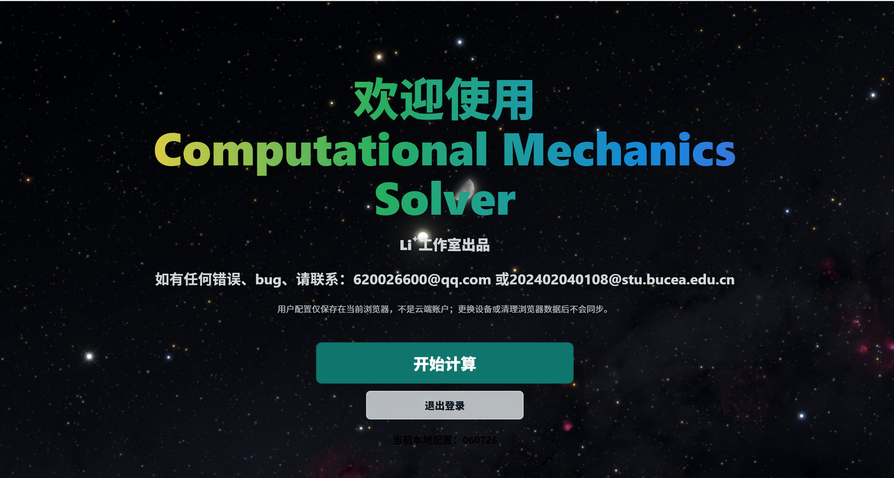
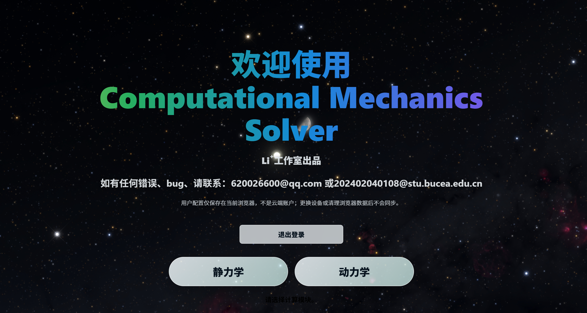
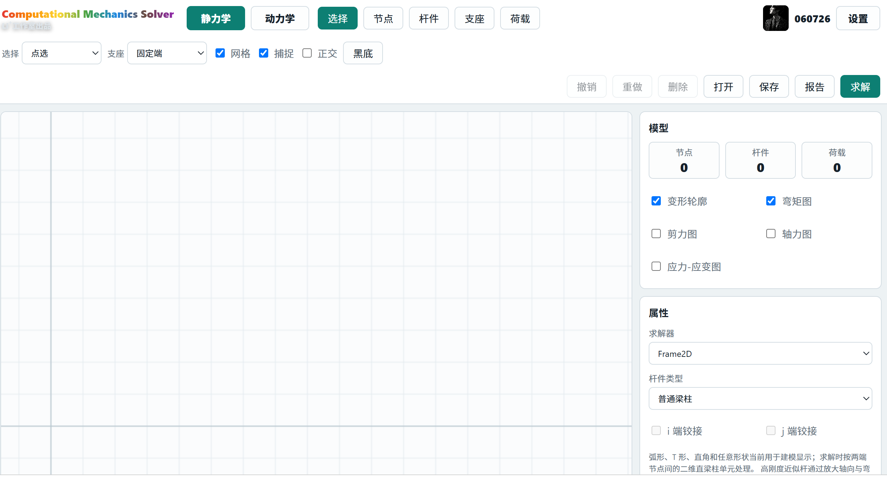
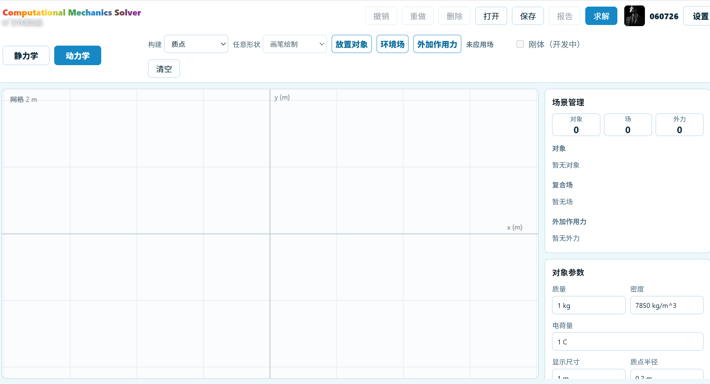

[[COVER]]

[[TOC]]

# 2. 版权与安全声明

版权所有 © 2026 Leo Li⁺ Studio。本文档对应产品发布名称 **Computational Mechanics Solver v1.3.2**，具体运行时构建标识为 `1.3.2-beta.2`。文档、源码快照和校验和应作为一个整体保存，以便确认计算所用版本。

> 本软件当前属于计算力学学习、教学演示、科研探索和原型验证工具。计算结果不应在未经独立复核的情况下直接用于建筑、机械、交通、能源或其他实际工程安全决策。使用者应使用解析解、标准算例、试验数据或成熟商业软件进行交叉验证，并对输入、理想化、边界条件和结果解释承担责任。

本版本没有工程规范校核、荷载组合、材料屈服、塑性、几何非线性、疲劳、断裂、接触或工程认证流程。报告中的“危险截面”和应力值是基于当前线弹性模型的估算，不等同于规范意义上的承载力验算。

主页中的“登录”和“注册”是浏览器本地配置，不是云端账户。昵称、头像和本地工程依赖浏览器存储；清理浏览器数据、使用无痕模式或更换设备后不会自动同步。不要在本地配置中保存密码、身份证号、密钥或其他敏感数据。

## 2.1 版本核验责任

正式复核前应访问 `/api/version`，确认 `version`、`git_commit`、`git_dirty` 和 `started_at`。生产实例应满足 `git_dirty=false`。相同 Git 提交号不一定代表相同运行进程，`started_at` 用于识别旧进程。

## 2.2 结果使用原则

- 先检查单位，再检查支座与荷载方向。
- 先检查模型诊断，再查看位移和内力。
- 用整体力与力矩平衡检查反力。
- 用解析解或标准算例检查至少一个关键结果。
- 对高刚度近似、释放端、有限区域场和大步长动力学结果进行敏感性检查。

# 3. 产品概述

Computational Mechanics Solver 是一个浏览器中的二维计算力学原型。它把图形建模、工程文件、单位换算、求解、结果可视化和 PDF 计算书连接为一个工作流。

产品分为两个模块：

- **静力学**：二维线弹性梁柱、平面桁架、高刚度近似杆、节点和杆件荷载、单端弯矩释放、位移、反力、杆端力及 N/V/M 图。
- **动力学**：二维独立质点平动，多对象分别积分，重力场、电场、磁场、有限区域场、冲量、持续力、RK4 轨迹和能量/动量结果。

当前版本的核心定位是“可追踪、可解释的学习与原型计算工具”，不是完整有限元平台或多体动力学引擎。界面中的显示几何不能自动提升为新的求解单元：弧形、T 形、直角和任意路径杆件在求解层仍按两端节点间的直线梁柱处理；动力学圆盘、矩形和杆只改变显示与惯量估算，平动方程仍是质点方程。



# 4. 版本信息

| 字段 | 值 |
|---|---|
| 产品名称 | Computational Mechanics Solver |
| 文档显示版本 | v1.3.2 |
| 运行时构建 | 1.3.2-beta.2 |
| 冻结 Git 提交 | 87b683d11bf028ca2db419ca607e5f915f15288f |
| 短提交号 | 87b683d |
| 静力学 Schema | cms-static-project@1 |
| 动力学 Schema | cms-dynamics-project@1 |
| 文档发布日期 | 2026-07 |
| 运行方式 | Web，本地或容器部署 |
| 推荐浏览器 | Chrome、Edge 当前稳定版 |
| 源码 ZIP SHA256 | 3a55ef342ebc769004d31ca9ad57332312ff7d3fca098226e1aec3c4c82662c1 |

`v1.3.2` 是产品发布名称；`1.3.2-beta.x` 是可追踪的具体构建标识。冻结源码基线已经在服务器实例中核验；本说明书、报告修复和主页改动位于本地工作分支，在人工推送和部署前不属于线上版本。

当前公开访问基线：[http://8.130.33.10:8765](http://8.130.33.10:8765)。访问公网实例时仍应通过 `/api/version` 核对具体运行构建。

# 5. 系统要求

## 5.1 直接运行

- Windows 10/11、Linux 或兼容环境。
- Python 3.11 及以上，核验环境为 Python 3.12。
- Python 包：`numpy`、`reportlab`、`pypdf`；开发测试使用标准库 `unittest` 和 Node.js。
- Chrome 或 Edge，建议桌面宽度不低于 1024 px。
- 保存工程和下载报告需要浏览器允许下载本地文件。

## 5.2 容器运行

仓库包含 `Dockerfile` 和 `.dockerignore`。`.dockerignore` 排除 `.git/`、`venv/`、缓存、字节码和 `.env`，避免把本地虚拟环境或秘密文件带入构建上下文。

## 5.3 资源边界

静力学使用 NumPy 密集矩阵求解，规模增加时内存约按自由度平方增长、分解时间约按自由度三次方增长。动力学在浏览器主线程执行，样本数过大会影响响应。v1.3.2 设有单对象步数和总样本上限，但没有后台任务队列或取消协议。

# 6. 启动方式

## 6.1 本地 Python

```powershell
cd "C:\Users\lijiahao\Desktop\软件开发"
python -m pip install -r requirements.txt
python run_webapp.py --host 127.0.0.1 --port 8765
```

浏览器打开：

```text
http://127.0.0.1:8765/
```

也可以使用模块入口：

```powershell
$env:PYTHONPATH = "src"
python -m mechanics_mvp.webapp --host 127.0.0.1 --port 8765
```

## 6.2 命令行静力学求解

```powershell
$env:PYTHONPATH = "src"
python -m mechanics_mvp examples\cantilever_beam.json `
  --report output\cantilever-report.pdf
```

标准输出为 JSON，包含节点位移、支座反力、杆端力、内力图采样和摘要。PDF 是可搜索的中文计算书，不再输出原始 JSON 堆栈。

## 6.3 Docker

```powershell
docker build -t mechanics:v1.3.2 .
docker run --rm -p 8765:8765 mechanics:v1.3.2
```

生产环境还应配置反向代理、HTTPS、请求大小限制、超时、日志、健康检查和可回滚镜像。仓库中的轻量 HTTP 服务不是完整的生产运维平台。

# 7. 当前主页与本地配置

主页使用星空图片作为背景。标题分为“欢迎使用”和“Computational Mechanics Solver”两行，标题与工作室文字使用动态色彩；联系邮箱使用灰白色。用户可点击“登录”或“注册”打开对应表单。

注册表单包含账户名、密码、昵称和可选头像。未上传头像时使用黑底白字 `CM` 默认头像。当前实现只把配置保存在浏览器，不会发送到后端数据库，也不具备找回密码、跨设备同步或真实鉴权能力。

完成本地配置后，页面显示“开始计算”，进入模块选择页。右上角设置可修改字体大小、昵称、密码提示信息和头像，也可退出本地配置。



## 7.1 本地数据注意事项

- 浏览器 `localStorage` 不是安全凭据仓库。
- 清理站点数据会删除本地配置。
- 在公共电脑上使用后应退出并清理站点数据。
- 工程成果应使用“保存”导出文件，不应只依赖浏览器状态。

# 8. 静力学模块快速入门

1. 进入“静力学”。
2. 选择“节点”，在画布放置节点。
3. 选择“杆件”，配置材料和截面，再依次选择两端节点。
4. 选择“支座”，将约束施加到节点。
5. 选择“荷载”，添加节点荷载、杆中集中作用或分布荷载。
6. 通过模型计数和诊断检查游离节点、零长度、约束不足和不连通部分。
7. 点击“求解”，选择位移、反力、内力图或其他结果。
8. 检查力与力矩平衡，再导出工程和计算书。

滚轮用于缩放；选择模式下可平移和框选；网格与捕捉可以切换。画布是无限世界坐标的局部视口，不是固定大小纸张。



# 9. 静力学建模对象

静力学数据边界包含节点、材料、截面、单元、节点荷载和单元荷载。显示层还保存支座图标角度、杆件显示几何、选择状态和视口。

| 对象 | 求解层含义 | 主要输入 |
|---|---|---|
| 节点 | 3 个二维全局自由度 `ux, uy, rz` | 坐标、约束 |
| 普通梁柱 | Euler-Bernoulli 二维梁柱单元 | 两端节点、E、A、I、端部释放 |
| 桁架杆 | 只贡献轴向 `EA/L` | 两端节点、E、A |
| 高刚度近似杆 | 普通梁柱刚度乘 1,000,000 | 两端节点、E、A、I |
| 显示几何 | 画布外观，不改变后端单元拓扑 | 直线、弧形、T 形、直角、手绘路径 |

节点固化是显示与编辑行为：被固化节点可以隐藏，但连接关系仍通过节点 ID 存在。隐藏节点不等于删除节点或合并有限元自由度。

# 10. 节点、单元和材料

## 10.1 节点自由度

每个节点的自由度顺序固定为：

```text
[ux, uy, rz]
```

单元自由度顺序固定为：

```text
[ux_i, uy_i, rz_i, ux_j, uy_j, rz_j]
```

坐标和长度进入后端前转换为米，力转换为牛顿，力矩转换为牛顿米。界面可以使用 `mm`、`m`、`N`、`kN`、`MPa`、`GPa` 等白名单单位。

## 10.2 材料与截面

普通梁柱使用弹性模量 `E`、面积 `A` 和惯性矩 `I`。泊松比、截面模量、惯性积、静矩和显示截面形状可以进入项目文件或界面，但并非全部进入当前梁柱刚度和应力恢复。

二维梁柱局部刚度由轴向项 `EA/L` 和弯曲项 `EI` 组成。模型假定线弹性、小位移、平截面和 Euler-Bernoulli 梁理论，不考虑剪切变形、材料非线性和二阶效应。

## 10.3 桁架

桁架局部 6×6 矩阵只在两端局部轴向位移位置提供 `EA/L`，转角和横向自由度相关项为 0。无刚度且无荷载的自由 DOF 会被过滤。桁架杆中横向荷载和力偶被拒绝；应在荷载位置插入节点并拆分杆件。

# 11. 支座和自由度约束

后端支座本质是节点的全局布尔约束：

| 常见图标 | 典型约束 | 说明 |
|---|---|---|
| 固定端 | `ux=true, uy=true, rz=true` | 约束两个平移和转角 |
| 铰支座 | `ux=true, uy=true, rz=false` | 允许节点转动 |
| 滚动支座 | 通常约束一个全局平移 | 实际方向取决于保存的布尔量，不取决于图标角度 |

**重要限制**：旋转支座目前只旋转图标并保存角度，求解器没有按角度建立斜向约束方程。斜面滚轮不能仅靠旋转图标得到正确约束。v1.3.2 应使用与全局 x/y 方向一致的约束，或在外部完成坐标变换。

地基和支座阴影是显示符号，不是弹性地基、接触或支座刚度单元。

# 12. 杆端释放

普通梁柱可在 i 端或 j 端设置单端弯矩释放。求解器不是简单把刚度矩阵某行某列清零，而是对局部弯曲自由度进行静力凝聚，并相应处理一致节点荷载。

释放端不传递端弯矩，仍可传递轴力和剪力。当前限制：

- 仅 `frame` 单元支持释放。
- 同一单元双端弯矩释放被验证层明确拒绝。
- 桁架和高刚度近似杆不接受释放标志。
- 释放不包含轴向释放、剪切释放、半刚接或转动弹簧。

建模双铰杆时，应根据受力机理使用桁架单元，或拆分模型并独立验证机构稳定性。

# 13. 集中力、集中力偶和分布荷载

## 13.1 节点荷载

节点可以施加全局 `Fx`、`Fy` 和 `Mz`。同一节点的多条荷载在求解向量中累加。

## 13.2 杆中集中作用

`point_global` 通过位置比例 `ratio∈[0,1]` 描述杆件上的作用点。全局力使用线性/三次 Hermite 形函数转为一致节点荷载；集中力偶使用形函数导数形成等效节点荷载。同一杆件可以保存并累加多个集中作用。

当 `ratio=0` 或 `ratio=1` 时，作用退化为端节点荷载。桁架杆只允许端点退化情况，内部作用会被拒绝。

## 13.3 分布荷载

| 类型 | 项目 kind | 当前含义 |
|---|---|---|
| 均布 | `uniform_local` | 局部 x/y 方向常值分布 |
| 三角/梯形 | `linear_local` | i/j 端值线性插值 |
| 多项式 | `polynomial_local` | 归一化杆长坐标上的多项式系数 |

求解器使用 8 点 Gauss 数值积分生成一致节点荷载。所谓“任意函数”目前不是通用符号表达式解释器，只接收多项式系数。沿杆均布力偶 `uniform_moment_local` 未实现并会明确报错。

# 14. 求解流程

静力学端到端链路为：

```text
画布模型
  -> ProjectAdapter / Schema 校验
  -> /api/solve
  -> project_from_dict（输入转 SI）
  -> diagnose_project / validate_project
  -> 单元矩阵与一致荷载组装
  -> 约束自由度划分
  -> numpy.linalg.solve(Kff, Pf)
  -> 反力与杆端内力恢复
  -> N/V/M 图采样
  -> 中文结果与报告
```

总体方程为：

```text
[K]{u} = {P}
```

约束后求解自由自由度子系统：

```text
[Kff]{uf} = {Pf}
```

反力向量按 `R=Ku-P` 恢复。若 `Kff` 奇异，软件返回约束不足、断开几何或机构相关错误。诊断中的静定指数 `r+3m-3j` 只是拓扑提示，不是刚度矩阵秩证明。

# 15. 位移、反力和杆端内力

结果中每个节点提供 `ux`、`uy`、`rz`。界面通常把平移显示为 mm，把转角显示为 rad。反力只对受约束自由度返回，键名为 `fx`、`fy`、`mz`。

每个梁柱单元提供：

```text
n_i, v_i, m_i, n_j, v_j, m_j
```

桁架至少提供 `n_i` 和 `n_j`，剪力和弯矩为 0。正负号取决于局部坐标和端力约定，比较前必须统一符号。

摘要中的最大平移只扫描节点。若梁跨中没有节点，即使连续挠曲线在跨中非零，“最大节点平移”也可能为 0。变形轮廓和内力图是可视化采样，不能替代连续场的严格极值搜索。

# 16. 弯矩图、剪力图和轴力图

N、V、M 图在独立直角坐标系中绘制，横轴为杆件局部位置 `x`，纵轴标注物理量和单位。分布荷载由数值积分恢复连续变化，杆中集中力或集中力偶位置会出现相应跳变。

- 集中横向力导致剪力跳变。
- 集中轴向力导致轴力跳变。
- 集中力偶导致弯矩跳变。
- 均布横向荷载使剪力线性变化、弯矩二次变化。

图上的虚线投影和数值标注用于读取极值。不同单元的局部坐标方向可能不同，拼接全结构图时应结合节点顺序解释正负号。


# 17. 静力学案例一：悬臂梁端部集中力

本案例来自冻结源码中的 `examples/cantilever_beam.json`，属于可复现补充案例，不是缺失用户案例的替代品。

## 17.1 输入

- 梁长 `L=2 m`，A 端固定，B 端自由。
- `E=200 GPa`，`A=10000 mm^2`，`I=80000000 mm^4`。
- B 点竖直向下集中力 `P=10 kN`。

## 17.2 解析关系

```text
uy(B) = -P L^3 / (3 E I)
rz(B) = -P L^2 / (2 E I)
RAy = P
MA = P L
```

## 17.3 计算结果

| 结果 | 程序值 | 解析值/检查 |
|---|---|---|
| B 点竖向位移 | -1.6666667 mm | -PL^3/(3EI) |
| B 点转角 | -1.25e-3 rad | -PL^2/(2EI) |
| A 点竖向反力 | 10.000 kN | 与外荷载平衡 |
| A 点反力矩 | 20.000 kN·m | P L |
| 最大剪力绝对值 | 10.000 kN | 常剪力 |
| 最大弯矩绝对值 | 20.000 kN·m | 固定端控制 |

新版静力学报告成功生成 3 页 PDF，包含输入、方程、推导、位移、反力、内力极值、诊断和结论。结果与解析关系在浮点误差范围内一致。

# 18. 静力学案例二：简支梁全跨均布荷载

本案例来自 `examples/simply_supported_uniform_beam.json`。

## 18.1 输入

- 梁长 `L=4 m`，A 为平面铰约束，B 为竖向滚动约束。
- `E=200 GPa`，`A=10000 mm^2`，`I=80000000 mm^4`。
- 全跨局部 y 向均布荷载 `q=-5 kN/m`，总荷载 `20 kN`。

## 18.2 解析与结果

```text
RAy = RBy = q L / 2 = 10 kN
Mmax = q L^2 / 8 = 10 kN·m
```

程序返回两端竖向反力各 `10.000 kN`，端弯矩为数值零，最大剪力绝对值 `10.000 kN`，跨中弯矩 `10.000 kN·m`。总反力与分布荷载合力平衡。

当前结果摘要只扫描节点平移，而本模型只在支座处设置节点，因此“最大节点平移”为 0。该字段不能解释为跨中挠度为 0；需要在跨中增加节点或扩展单元内部位移恢复。此例说明读取结果时必须区分节点量与单元内部量。

<!-- pagebreak -->

# 19. 动力学模块快速入门

1. 进入“动力学”，画布初始为空，仅显示网格和坐标轴。
2. 配置质点或显示形状的质量、电荷、初始位置和初速度。
3. 点击“放置对象”，在画布指定位置。
4. 点击“环境场”，配置重力、电场或磁场及作用范围。
5. 可重复添加多个场，形成不同范围的复合场。
6. 点击“外加作用力”，选择瞬时力/冲量或持续力并指定对象。
7. 设置总时长和步长，点击“求解”并选择结果项。
8. 选择轨迹时，画布回放已经计算的样本并保留轨迹线。



# 20. 动力学对象和初始条件

核心动力学状态为：

```text
Y = [x, y, vx, vy]
```

每个对象必须有正质量，可以有电荷、初始位置、初速度和显示尺寸。支持的显示种类包括质点、杆、圆、圆环、矩形和任意路径，但它们共享同一质点平动积分器。

| 输入 | 进入核心计算 | 说明 |
|---|---|---|
| 质量 m | 是 | 决定 F/m 和动量 |
| 电荷 q | 是 | 决定电场力和洛伦兹力 |
| x, y, vx, vy | 是 | 初始状态 |
| 尺寸/路径 | 部分 | 显示与转动惯量估算 |
| 密度、材料 E | 否 | 当前仅保存/显示 |
| 刚体复选框 | 否 | 没有姿态和角速度状态 |

转动惯量按简单几何公式估算并显示，但不进入 `Iα=Στ`。当前角动量是关于全局原点的轨道角动量 `Lz=m(x vy-y vx)`，不是物体自转角动量。

# 21. 重力场、电场和磁场

## 21.1 重力场

方向由角度定义，场向量为 `g=(g cosθ, g sinθ)`，加速度直接叠加到对象。势能采用 `U=-m g·r`，全局原点为零势能参考。

## 21.2 电场

电场向量为 `E=(E cosθ, E sinθ)`，带电质点受力 `F=qE`，加速度 `a=qE/m`，势能 `U=-qE·r`。

## 21.3 磁场

磁场只表示垂直二维平面的均匀 `Bz`。点符号表示向外，叉符号表示向内。核心使用：

```text
Fx = q vy Bz
Fy = -q vx Bz
```

磁场力理想情况下与速度垂直，不做功。当前不支持空间梯度、磁偶极、感应电场或三维磁场。

# 22. 全局、矩形、圆形与任意区域场

场范围可以是：

| 范围 | 几何输入 | 点内判定 |
|---|---|---|
| 全局 | 无边界 | 所有位置生效 |
| 矩形 | 中心、宽、高 | 轴对齐包围范围 |
| 圆形 | 圆心、半径 | 到圆心距离不超过半径 |
| 任意区域 | 至少 3 个路径点 | 闭合多边形点内判定 |

矩形通过角点拖动，圆形通过圆心到边界拖动，自定义范围通过自由路径完成。未完成几何保持为草稿，不写入正式 `fields` 数组；完成时一次加入撤销历史。Escape、右键、模块切换、清空或开始其他工具会取消草稿。

自定义多边形必须有非零面积。工程导入、画布创建和求解前验证使用同一标准。任意范围是折线闭合多边形，不是光滑曲线或符号边界。

有限重力/电场目前只在区域内使用线性势能表达式，穿越边界时缺少连续势函数，因此核心会给出势能参考诊断。不要把有限区域场的机械能变化直接解释为数值积分误差。

# 23. 冲量和持续力

## 23.1 瞬时力/冲量

瞬时作用在积分开始前改变速度：

```text
Δv = J / m
```

它不在后续时间持续提供力。v1.3.2 的冲量固定发生在初始时刻，不支持任意时刻冲量事件。

## 23.2 持续力

持续力可设置 x/y 分量、开始时间和持续时间。`duration=0` 表示从开始时刻作用到求解结束。当前积分步不会强制在开始/结束事件时间切分；如果事件时间不落在步长节点上，启停时刻附近会有步长误差。减小步长并做收敛检查。

外力通过 `targetId` 作用于指定对象。多个对象之间没有自动引力、电力或碰撞力。

# 24. RK4 时间积分

动力学使用经典四阶 Runge-Kutta 法。对状态方程 `dY/dt=f(t,Y)`：

```text
k1 = f(t, Y)
k2 = f(t+h/2, Y+h k1/2)
k3 = f(t+h/2, Y+h k2/2)
k4 = f(t+h, Y+h k3)
Y(next) = Y + h(k1+2k2+2k3+k4)/6
```

最后一步会缩短以精确到达总时长。当前没有自适应步长、局部误差估计、事件求根或辛积分器。对于长时间磁场轨迹、强场和快速启停外力，应分别用 `h` 和 `h/2` 计算，比较关键结果是否收敛。

积分每步保存 `x,y,vx,vy,ax,ay,t`，动画只是对保存样本的回放，不会在播放时重新计算。

# 25. 轨迹、动画和结果

求解结果包括每个对象的终态、样本、动能、势能、机械能、动量、轨道角动量、洛伦兹力和惯量估算。系统摘要对各对象的能量和动量求和。

只有全程恒加速度且场内外状态不变时，程序输出二次解析轨迹模型；磁场、分区场和分段外力返回“数值积分轨迹”。

轨迹动画使用当前视口绘制样本路径和对象位置。缩放或平移只改变显示，不改变已计算世界坐标。多个对象分别积分，轨迹相交时对象会互相穿透。


# 26. 动力学案例一：全局重力场抛体

这是可复现补充案例。

## 26.1 输入

- 质点 `m=1 kg`、`q=0 C`。
- 初始位置 `(0,0) m`，初速度 `(8,12) m/s`。
- 全局重力场 `9.8 m/s^2`，方向 `-90°`。
- 总时长 `2 s`，步长 `0.02 s`，无外加作用力。

## 26.2 解析式

```text
x(t) = 8 t
y(t) = 12 t - 4.9 t^2
vx(t) = 8
vy(t) = 12 - 9.8 t
```

## 26.3 结果

终态位置 `(16.0000,4.4000) m`，速度 `(8.0000,-7.6000) m/s`，加速度约 `(0,-9.8) m/s^2`。动能 `60.88 J`，势能 `43.12 J`，机械能 `104.00 J`，与初始机械能一致。100 个积分步产生 101 个样本。

报告成功生成 2 页 PDF，包含对象、场、RK4 过程、结果、结论和限制。数值与常加速度解析式一致。

# 27. 动力学案例二：均匀磁场圆周运动

## 27.1 输入与理论值

- 质点 `m=1 kg`、`q=1 C`。
- 初始位置 `(0,0) m`，初速度 `(1,0) m/s`。
- 全局磁场 `B=1 T`，方向向外。
- 总时长 `2π s`，步长 `0.002 s`。

理论半径和周期：

```text
r = m v / (|q| B) = 1 m
T = 2π m / (|q| B) = 2π s
```

## 27.2 结果

一个理论周期后，程序位置约为 `(-3.70e-13,1.64e-16) m`，速度约为 `(1.0,3.70e-13) m/s`，动能为 `0.5 J`。初始与终态机械能差约 `1.1e-15 J`，终态洛伦兹力与速度近似垂直。

该案例验证了 RK4 的周期闭合和磁场力不做功的数值行为，但产品尚未自动计算理论半径、周期和相对误差。用户上传的磁场截图因缺少质量、电荷、磁场和冲量完整输入，只能作为界面证据。

<!-- pagebreak -->

# 28. 项目文件和 Schema

静力学和动力学工程使用不同 Schema：

```text
cms-static-project@1
cms-dynamics-project@1
```

前端 `project-schema.js` 负责迁移旧格式、验证对象类型、唯一 ID、引用关系、单位、尺寸、范围和作用对象；`project-adapter.js` 负责从界面状态序列化及恢复。

## 28.1 静力学最小结构

```json
{
  "schema": "cms-static-project@1",
  "application": "computational-mechanics-solver",
  "module": "statics",
  "materials": [],
  "sections": [],
  "nodes": [],
  "elements": [],
  "loads": {"nodes": [], "elements": []}
}
```

## 28.2 动力学最小结构

```json
{
  "schema": "cms-dynamics-project@1",
  "application": "computational-mechanics-solver",
  "module": "dynamics",
  "model": "independent-particle2d",
  "simulation": {"duration": "2 s", "timeStep": "0.02 s"},
  "objects": [],
  "fields": [],
  "forces": []
}
```

工程 JSON 是不受信任输入。导入时会验证重复 ID、缺失引用、非正质量、无效场范围、未知荷载和不支持释放。项目文件版本 `@1` 不保证未来大版本自动兼容；升级前保留原文件副本。

# 29. 报告生成

## 29.1 静力学计算书

`report.py` 使用 ReportLab 生成中文 PDF。计算书包含工程名称、求解范围、模型输入、材料、截面、节点、单元、荷载、诊断、位移、反力、杆端力、N/V/M 极值、应力/应变估算、控制方程、推导、结论和限制。用户选择的模型图和内力图会作为独立图片页附后。

应力估算使用：

```text
σ = N/A + M c/I
ε = σ/E
```

其中 `c` 在缺少真实截面纤维信息时采用简化估计，因此结果只能用于趋势判断。

## 29.2 动力学计算书

`dynamics-report.js` 从对象、场、外力和求解结果构造可读文本；`report.py` 再生成 PDF。界面结果与报告共用同一结果格式化逻辑，内容包括步长、步数、样本、能量、动量、对象终态、场、外力、RK4、结论和限制。

报告文字可搜索和复制。图片置于正文之后，避免覆盖文字。服务器使用系统中文字体；没有系统字体时回退到内置 CID 中文字体。

## 29.3 安全边界

静力学报告在服务器重新求解，不信任前端传入结果。动力学报告当前接收前端生成的 `report_text`，长度上限为 200000 字符；后端没有重新运行 JavaScript 动力学核心，因此它是客户端结果的格式化导出，不是独立服务端复算证明。

# 30. Web API

当前 HTTP 服务基于 Python `ThreadingHTTPServer`，不需要账户或令牌。它没有数据库、云工程、配额、作业队列或跨设备持久化。

| 方法与路径 | 请求 | 成功响应 | 错误 |
|---|---|---|---|
| `GET /api/version` | 无 | 版本、提交、dirty、启动时间、Python、Schema | 未定义专用错误结构 |
| `POST /api/solve` | 静力学 Project JSON | JSON：位移、反力、杆端力、内力图、summary | 422 `{"error":"..."}` |
| `POST /api/report` | 静力学 Project，加可选图片/选项 | `application/pdf`，附件名 `mechanics-report.pdf` | 422 JSON error |
| `POST /api/dynamics-report` | `report_text` 和可选图片 | `application/pdf`，附件名 `dynamics-report.pdf` | 422 JSON error |
| `GET /` | 无 | `web/index.html` | 404 |
| `GET /static/<path>` | 静态相对路径 | 静态文件 | 404，阻止目录穿越 |

## 30.1 版本响应

```json
{
  "application": "computational-mechanics-solver",
  "version": "1.3.2-beta.2",
  "git_commit": "87b683d",
  "git_dirty": false,
  "started_at": "2026-07-11T12:45:12Z",
  "python_version": "3.12.9",
  "schema_static": "cms-static-project@1",
  "schema_dynamics": "cms-dynamics-project@1"
}
```

## 30.2 并发和安全限制

服务按请求创建线程；静力学 NumPy 求解和 PDF 生成仍消耗同一进程资源。当前没有认证、限流、CSRF 防护、结构化请求 ID、请求体大小总限制、超时和生产级访问日志。`/api/dynamics-report` 有文本长度限制，但图片数据 URL 仍可能扩大请求。公网部署必须由反向代理补充 HTTPS、大小限制、超时和安全头。

# 31. 输入校验与错误响应

验证分为三层：前端 Schema、后端预处理/诊断和求解器数值错误。常见拒绝条件包括：

- 重复节点、单元、材料、截面、对象、场或外力 ID。
- 单元引用不存在节点、材料或截面。
- 零长度杆件、孤立节点、约束不足或不连通结构。
- 非正 E、A、I、质量、尺寸、场半径或仿真时长。
- 自定义场少于 3 点或多边形面积为 0。
- 不支持的双端释放、均布力偶、桁架杆中荷载或 PINN。
- 奇异刚度矩阵。
- 动力学步数或总样本数超过上限。

API 捕获异常并返回 HTTP 422：

```json
{"error": "用户可读的错误文本"}
```

当前错误结构没有稳定错误码、字段路径或 request ID，调用方不应依赖英文错误消息做业务分支。

# 32. 已实现功能矩阵

完整审计位于 `release/v1.3.2/feature-matrix.md`。下表是用户可见能力摘要。

| 模块 | 已实现 | 部分/未实现 |
|---|---|---|
| 静力学单元 | 二维梁柱、桁架、单端弯矩释放 | 高刚度杆是近似；曲线/T 形等仅显示；双端释放未实现 |
| 静力学荷载 | 节点力/力矩、杆中集中力/力偶、均布、线性、多项式 | 均布力偶未实现；通用函数解释器未实现 |
| 静力学结果 | 节点位移、反力、杆端力、N/V/M、诊断、PDF | 节点外连续位移恢复有限；应力为简化估算 |
| 动力学模型 | 独立质点平动、多对象分别积分 | 无碰撞、对象间力、约束和刚体转动 |
| 动力学环境 | 重力、电场、磁场、复合场和四类范围 | 无三维场、磁场梯度和连续有限场势函数 |
| 动力学作用 | 初始冲量、分段持续力 | 冲量不能设任意时刻；事件不强制切步 |
| 动力学结果 | 轨迹、动画、能量、动量、轨道角动量、洛伦兹力、PDF | 无自转角速度/角加速度/力矩积分，无自动误差报告 |
| 账户与存储 | 浏览器本地配置、工程文件保存/打开 | 无真实账户、云项目和跨设备同步 |

# 33. 已知限制

完整 26 项限制及证据位于 `release/v1.3.2/known-limitations.md`。最重要限制如下。

1. 动力学对象彼此独立，会相互穿透。
2. 没有真正刚体转动、姿态、角速度、角加速度或力矩积分。
3. 曲线、T 形、直角和任意路径杆件只改变显示，求解使用端点弦线。
4. 高刚度近似杆通过放大刚度实现，不是严格刚性约束，可能恶化条件数。
5. 旋转支座只旋转图标，不改变全局约束方向。
6. 普通梁柱只支持单端弯矩释放；双端释放被拒绝。
7. 桁架只传轴力，不能承受杆中横向力或力偶。
8. 均布力偶和 PINN 求解器未实现。
9. 静定指数是拓扑筛查，不是刚度秩证明。
10. 静力学采用密集矩阵，小规模适用，未提供稀疏求解和条件数报告。
11. 动力学 RK4 为固定步长，外力事件没有强制时间切分。
12. 有限重力/电场势能在区域边界不连续。
13. 报告应力采用简化截面边缘距离，只能作趋势估算。
14. 本地配置和工程状态不具备云同步或安全认证。
15. 轻量 HTTP 服务缺少生产级限流、队列、审计日志和完整安全策略。

遇到这些边界时，软件应明确拒绝或提示，不应通过隐藏警告把未实现能力包装成已实现。

# 34. 常见问题与故障排查

## 34.1 浏览器显示旧代码

访问 `/api/version`，比较 `started_at` 和当前重启时间；确认 `git_commit` 与预期一致。关闭旧端口进程，从正确仓库和 Python 环境重新启动，再进行强制刷新。只比较提交号不足以识别同一提交上的旧进程。

## 34.2 `Unsupported element load kind: point_global`

这通常表示浏览器连接到旧后端。当前冻结代码支持 `point_global`。用 `/api/version` 检查进程身份，不要先重写求解器。

## 34.3 奇异矩阵

检查每个连通分量是否有足够约束、是否存在孤立节点、零长度、共线机构、释放过多或只有显示几何但缺少真实节点连接。诊断没有 error 也不保证矩阵满秩。

## 34.4 报告乱码

确认安装 `reportlab`，并使用新版 `report.py`。Windows 优先使用等线字体，Linux 可回退到 `STSong-Light`。若 shell 管道把 UTF-8 先转换成问号，PDF 后端无法恢复，应直接以 UTF-8 传入文本。

## 34.5 动力学轨迹不闭合或能量漂移

减小步长，比较 `h` 与 `h/2`。确认场范围、方向、电荷符号和持续力时间。有限区域场的势能跳变不是单纯 RK4 漂移。

## 34.6 保存后换设备找不到账户

当前是本地配置，不是云端账户。通过“保存”导出工程文件，并自行备份。

# 35. 开发者技术架构

```text
src/mechanics_mvp/
├── models.py       冻结数据类和 DOF 合同
├── project_io.py   JSON -> 领域模型，单位转 SI
├── preprocess.py   结构引用、几何、单元/荷载适用性验证
├── solver.py       二维梁柱/桁架组装、求解和结果恢复
├── engine.py       诊断层与求解后端注册
├── diagnostics.py  拓扑、约束和问题列表
├── report.py       中文静力学与文本 PDF
├── webapp.py       轻量 HTTP、静态资源和 API 边界
├── units.py        单位白名单与 SI 转换
└── cli.py          命令行入口
```

前端关键模块：

```text
web/project-schema.js            项目迁移与输入校验
web/project-adapter.js           界面状态序列化/恢复
web/dynamics-core.js             无 DOM 的动力学数值核心
web/dynamics-field-geometry.js    场几何纯函数
web/dynamics-field-placement.js   无 DOM 的场放置状态机
web/dynamics-report.js            动力学结果和报告文本
web/app.js                        当前应用状态、控制器和渲染整合
```

当前主要架构债务是 `app.js` 仍承担状态、DOM 事件、项目读写、静力学渲染和动力学渲染。v1.3.3 计划依次拆出 Store、Renderer、Results 和 Controller，不在 v1.3.2 文档工作中改变行为。

后端求解和界面解耦：CLI 与 `/api/solve` 共用 `engine.solve_with_backend`。PINN 只存在占位后端并必然抛出明确错误，不能在产品中选择为可用求解器。

# 36. 测试体系

Python 测试覆盖单位、项目解析、诊断、引擎诊断、梁柱、桁架、端部释放、杆中集中作用、报告、Web API 和端到端 HTTP。JavaScript 测试覆盖单位、项目 Schema、适配器、动力学核心、场放置、导入文本安全、头像布局和动力学报告。

关键解析/回归案例包括：

- 悬臂梁端力 `PL^3/(3EI)`。
- 简支梁均布荷载对称反力。
- 线性和多项式分布荷载平衡。
- 桁架 `u=PL/(EA)` 与轴力。
- 单端弯矩释放固铰梁。
- 杆中集中力、集中力偶、同杆多集中作用和端点退化。
- 重力、电场、冲量、持续力、磁场周期和 RK4 收敛阶。
- 自定义场非零面积、矩形/圆形几何和事务撤销。
- PDF 中文提取、公式、结论和无 Unicode 替换字符。

发布前还应运行浏览器人工验收。自动测试不能验证所有像素布局、下载对话框、浏览器字体和真实交互顺序。

# 37. v1.3.2 更新说明

## 37.1 已验证新增与改进

- 动力学模块向用户开放二维独立质点求解、多对象分别积分、重力/电场/磁场、复合范围、冲量、持续力、轨迹动画和结果汇总。
- 静力学新增/巩固桁架单元、普通梁柱单端弯矩释放、杆中集中力/力偶和同杆多作用累加。
- 模型诊断接入正式求解入口和结果摘要。
- 工程 Schema、迁移、单位和引用验证更加严格，自定义场必须围成非零面积。
- `/api/version` 提供版本、提交、dirty 状态和启动时间，帮助识别旧进程。
- 静力学和动力学 PDF 改为可搜索的中文计算书，包含输入、公式、过程、结果和结论，不再以乱码或原始 JSON 为主要内容。
- 场放置使用草稿与一次事务提交，取消不会污染正式场或撤销栈。

## 37.2 明确未包含

对象间碰撞、刚体自转、弹簧/约束、斜向支座数学、双端释放、均布力偶、PINN、云账户和工程认证不属于 v1.3.2 已实现能力。

# 38. 术语表

| 术语 | 含义 |
|---|---|
| DOF | 自由度；本静力学节点为 ux、uy、rz |
| SI | 国际单位制；后端求解统一使用 N、m、Pa 等 |
| 梁柱单元 | 同时提供轴向和弯曲刚度的二维线弹性单元 |
| 桁架单元 | 只传递轴力的二维杆单元 |
| 端部释放 | 通过静力凝聚取消指定端弯矩传递 |
| 一致节点荷载 | 按单元形函数把杆上作用等效到节点的荷载向量 |
| N/V/M | 轴力、剪力和弯矩 |
| RK4 | 经典四阶 Runge-Kutta 固定步长积分 |
| 轨道角动量 | 质点相对全局原点的 `m(x vy-y vx)` |
| Schema | 工程 JSON 的结构和版本合同 |
| dirty | Git 工作区存在未提交修改 |
| started_at | Web 进程启动时间，用于识别旧实例 |
| B 级案例 | 只有截图，可核查界面但不能完整复算 |

# 39. 版本与构建证据

## 39.1 固定源码

```text
文件：release/v1.3.2/mechanics-v1.3.2-source.zip
来源：git archive 87b683d11bf028ca2db419ca607e5f915f15288f
文件数：55
SHA256：3a55ef342ebc769004d31ca9ad57332312ff7d3fca098226e1aec3c4c82662c1
```

解压核查确认包含 Dockerfile、依赖文件、启动脚本、`src/`、`web/`、`tests/` 和 `examples/`，不包含 `.git`、虚拟环境、缓存、密钥或服务器认证信息。

## 39.2 案例证据

四个用户案例槽位中，发现一张静力学截图和一张动力学截图，均缺少工程文件；另外两个案例缺失。完整记录见 `release/v1.3.2/case-verification.md`。为提供可复现证据，补充运行了悬臂梁、简支均布梁、重力抛体和均匀磁场圆周运动，且没有把它们冒充为用户案例。

## 39.3 文档来源

本说明书由以下固定证据生成：

- `release/v1.3.2/version.txt`
- `release/v1.3.2/feature-matrix.md`
- `release/v1.3.2/known-limitations.md`
- `release/v1.3.2/case-verification.md`
- 冻结源码 ZIP、自动测试、真实 API 响应和用户上传截图

构建命令：

```powershell
python tools\build_manual.py
```

构建脚本把 PDF 写入 `web/downloads/computational-mechanics-solver-v1.3.2-manual.pdf`，复制到 `release/v1.3.2/`，并更新 SHA256。最终 PDF 的哈希以同目录 `checksums.sha256.txt` 为准。

## 39.4 联系方式

问题和缺陷反馈：`620026600@qq.com` 或 `202402040108@stu.bucea.edu.cn`。反馈时请提供运行时版本、Git 提交、浏览器、工程文件、复现步骤和错误文本；发送前移除密码、密钥及个人敏感信息。

## 39.5 文档结束状态

本说明书共覆盖产品边界、操作流程、控制方程、四个可复现补充案例、用户截图证据、项目 Schema、Web API、测试和限制。阅读结束后，请把 `version.txt`、源码 ZIP 和 `checksums.sha256.txt` 与本 PDF 一并归档。

> 文档到此结束。任何计算结论在用于实际决策前，都应由独立方法复核。
